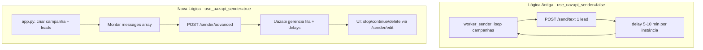

# Tech-Spec: Nova lógica de campanhas via API Uazapi

**Created:** 2026-03-05  
**Complemento de:** [tech-spec-migrar-disparador-superadmin-uazapi.md](tech-spec-migrar-disparador-superadmin-uazapi.md)

## Overview

### Problem Statement

A lógica atual de envio usa o worker (worker_sender.py) que processa campanhas uma mensagem por vez via POST /send/text, com delay fixo 5–10 min por instância. O cliente deseja migrar para a **API nativa de campanhas da Uazapi**, que oferece criar campanha, envio em massa avançado com delays configuráveis, listar mensagens/contatos e controlar campanha (stop/continue/delete). A lógica antiga deve ser mantida para clientes que ainda a utilizam.

### Solution

Implementar modo dual: campanhas com `use_uazapi_sender=true` usam a API Uazapi (POST /sender/advanced, /sender/edit, etc.); campanhas com `use_uazapi_sender=false` continuam com o worker atual. Cada campanha fica vinculada a uma instância (1 número de WhatsApp). Delays configuráveis pelo cliente (recomendado 5–15 min). Nova lógica disponível para todos os usuários com instâncias Uazapi; lógica antiga preservada.

### Scope

**In Scope:**
1. Criar campanha via POST /sender/advanced (envio em massa avançado) com delays configuráveis
2. Vínculo campanha ↔ instância (1 número WhatsApp por campanha)
3. Delays configuráveis: delay_min_minutes, delay_max_minutes (recomendado 5–15 min)
4. Variações de mensagem (pacote com 5 variações): montar no código com random.choice antes de chamar API
5. Listar mensagens: POST /sender/listmessages + campaign_leads
6. Listar contatos: campaign_leads (nosso) + opcional sync com Uazapi
7. Controlar campanha: stop, continue, delete via POST /sender/edit
8. Modo dual: manter worker antigo; nova lógica opt-in por campanha
9. Aplicar a todos os usuários com instâncias Uazapi (não só superadmin)
10. **Atualizar frontend** com opções da API: definir delay mínimo/máximo, vincular stop/delete/continue aos botões existentes, selecionar instância para a campanha

**Out of Scope:**
- Cadence (follow-ups) com Uazapi — mantém worker_cadence (MegaAPI) por enquanto
- Comportamento de múltiplas campanhas concomitantes — validar em uma campanha primeiro
- Usuários com MegaAPI — continuam com lógica antiga apenas

## Context for Development

### Vínculo Campanha ↔ Instância

- Cada instância = 1 número de WhatsApp
- Cada campanha deve estar vinculada a uma instância específica
- Já existe: `campaign_instances` (campaign_id, instance_id) e `rotation_mode` (single/round_robin)
- Com `use_uazapi_sender=true`, a campanha usa a instância associada (token) para chamar a API Uazapi

### Modo Dual

| use_uazapi_sender | Fluxo |
|-------------------|-------|
| false (padrão) | Worker atual: POST /send/text um-a-um, delay por instância |
| true | API Uazapi: POST /sender/advanced com messages array, Uazapi gerencia fila |

### Fluxo Atual vs Novo



### Endpoints Uazapi Relevantes

| Endpoint | Método | Uso |
|----------|--------|-----|
| /sender/advanced | POST | Criar envio em massa. Payload: delayMin, delayMax (segundos), messages (array de {number, type, text}) |
| /sender/edit | POST | Controlar: {folder_id, action: "stop"\|"continue"\|"delete"} |
| /sender/listfolders | GET | Listar campanhas (query status: Active, Archived) |
| /sender/listmessages | POST | Listar mensagens: {folder_id, messageStatus?, page, pageSize} |
| /chat/check | POST | Verificar números em batch: {numbers: [...]} |

Referência: `uazapi-openapi-spec (1).yaml` (linhas 9367–10130)

### Atualização do Frontend (Requisito)

É necessário atualizar o frontend para expor as opções da API Uazapi:

1. **Definir delay mínimo e máximo** — Campos no formulário de criação/edição de campanha para o usuário configurar delay_min_minutes e delay_max_minutes (recomendado 5–15 min).

2. **Vincular stop, delete e continue aos botões existentes** — Os botões de Pausar, Continuar e Deletar já existentes na listagem de campanhas devem chamar a API Uazapi (POST /sender/edit) quando a campanha tiver use_uazapi_sender=true, em vez de apenas atualizar o DB. Manter comportamento atual para campanhas use_uazapi_sender=false.

3. **Selecionar instância para a campanha** — O formulário deve permitir ao usuário escolher qual instância (número de WhatsApp) será usada para aquela campanha. Exibir apenas instâncias Uazapi quando use_uazapi_sender=true.

### Files to Reference

| File | Purpose |
|------|---------|
| app.py | campaign create, rotas de campanha, toggle_pause |
| worker_sender.py | process_campaigns, send_message, instance_next_send_time |
| services/uazapi.py | UazapiService (send_text, check_phone, get_status, etc.) |
| templates/campaigns_new.html | Formulário criação campanha, message_templates, instance_ids |
| templates/campaigns.html | Listagem campanhas, botões pause/play (existentes) |
| uazapi-openapi-spec (1).yaml | /sender/advanced, /sender/edit, /sender/listfolders, /sender/listmessages |

## Technical Decisions

1. **Colunas novas em campaigns**:
   - `uazapi_folder_id` (TEXT, nullable) — ID retornado pela Uazapi
   - `use_uazapi_sender` (BOOLEAN, default false) — opt-in para nova lógica
   - `delay_min_minutes` (INTEGER, nullable) — delay mínimo em minutos
   - `delay_max_minutes` (INTEGER, nullable) — delay máximo em minutos

2. **Variações de mensagem**: API não suporta "escolher 1 de 5 por destinatário". Ao montar o array messages, para cada lead aplicar `random.choice(variations)` e incluir uma mensagem por lead.

3. **Verificação de número**: Opcionalmente usar POST /chat/check em batch antes de /sender/advanced para filtrar leads sem WhatsApp.

4. **Worker**: Se `campaign.use_uazapi_sender = true`, o worker_sender **não processa** essa campanha — a Uazapi gerencia o envio.

5. **Instâncias**: Nova lógica exige instâncias Uazapi (api_provider='uazapi'). Usuários com MegaAPI continuam apenas com lógica antiga.

6. **Validação inicial**: Testar com uma campanha primeiro; comportamento de múltiplas campanhas concomitantes em fase posterior.

## Implementation Plan

### Sprints

As tasks foram agrupadas em sprints de 1–3 tasks conforme interdependências. Execute em ordem.

| Sprint | Tasks | Foco | Dependências |
|--------|-------|------|--------------|
| **Sprint 1** | 15, 16 | Fundação: DB + API | Nenhuma |
| **Sprint 2** | 17, 18 | Backend: fluxo de criação + worker | Sprint 1 |
| **Sprint 3** | 19, 22 | UI formulário: delay + seletor de instância | Sprint 1 |
| **Sprint 4** | 20 | Controle: stop/continue/delete nos botões existentes | Sprint 1, 2 |
| **Sprint 5** | 21 | Listar mensagens (opcional) | Sprint 1, 2 |

### Prompts para Quick Dev

Execute cada sprint em ordem. Use `/bmad-bmm-quick-dev` e cole o bloco completo do sprint desejado como mensagem. O agente carregará o spec e implementará apenas as tasks indicadas.

---

**Sprint 1 — Fundação (Tasks 15, 16)**

```
Implemente o Sprint 1 do tech-spec _bmad-output/implementation-artifacts/tech-spec-campanhas-uazapi-api.md.

Execute APENAS as Tasks 15 e 16:
- Task 15: Adicionar colunas uazapi_folder_id, use_uazapi_sender, delay_min_minutes, delay_max_minutes à tabela campaigns
- Task 16: Estender UazapiService com create_advanced_campaign, edit_campaign, list_folders, list_messages

Ignore as demais tasks. Siga o spec completo para contexto e decisões técnicas.
```

---

**Sprint 2 — Backend (Tasks 17, 18)**

```
Implemente o Sprint 2 do tech-spec _bmad-output/implementation-artifacts/tech-spec-campanhas-uazapi-api.md.

Execute APENAS as Tasks 17 e 18:
- Task 17: Fluxo de criação de campanha com use_uazapi_sender — montar messages array, chamar create_advanced_campaign, salvar uazapi_folder_id
- Task 18: Worker ignorar campanhas use_uazapi_sender=true na query de campanhas ativas

Requer Sprint 1 concluído. Ignore as demais tasks.
```

---

**Sprint 3 — UI formulário (Tasks 19, 22)**

```
Implemente o Sprint 3 do tech-spec _bmad-output/implementation-artifacts/tech-spec-campanhas-uazapi-api.md.

Execute APENAS as Tasks 19 e 22:
- Task 19: UI — checkbox use_uazapi_sender e campos delay_min_minutes, delay_max_minutes no formulário de criação (campaigns_new.html)
- Task 22: UI — seletor de instância no formulário; listar apenas instâncias Uazapi quando use_uazapi_sender=true; seleção obrigatória

Requer Sprint 1 concluído. Vincular aos botões/campos existentes. Ignore as demais tasks.
```

---

**Sprint 4 — Controle (Task 20)**

```
Implemente o Sprint 4 do tech-spec _bmad-output/implementation-artifacts/tech-spec-campanhas-uazapi-api.md.

Execute APENAS a Task 20:
- Task 20: Criar rota POST /api/campaigns/<id>/uazapi-control; vincular stop/continue/delete aos BOTÕES EXISTENTES de Pausar, Continuar e Deletar na listagem de campanhas. Quando use_uazapi_sender=true, chamar UazapiService.edit_campaign. Manter comportamento atual para use_uazapi_sender=false.

Requer Sprints 1 e 2 concluídos. Ignore as demais tasks.
```

---

**Sprint 5 — Listar mensagens (Task 21)**

```
Implemente o Sprint 5 do tech-spec _bmad-output/implementation-artifacts/tech-spec-campanhas-uazapi-api.md.

Execute APENAS a Task 21:
- Task 21: Rota GET /api/campaigns/<id>/uazapi-messages que chama UazapiService.list_messages e retorna mensagens da Uazapi

Requer Sprints 1 e 2 concluídos. Opcional. Ignore as demais tasks.
```

---

### Tasks

- [x] Task 15: Adicionar colunas à tabela campaigns
  - File: `app.py` (init_db ou migração)
  - Action: `ALTER TABLE campaigns ADD COLUMN IF NOT EXISTS uazapi_folder_id TEXT; ADD COLUMN IF NOT EXISTS use_uazapi_sender BOOLEAN DEFAULT false; ADD COLUMN IF NOT EXISTS delay_min_minutes INTEGER; ADD COLUMN IF NOT EXISTS delay_max_minutes INTEGER;`

- [x] Task 16: Estender UazapiService com métodos de campanha
  - File: `services/uazapi.py`
  - Action: Adicionar métodos: create_advanced_campaign(token, delay_min_sec, delay_max_sec, messages, info?, scheduled_for?), edit_campaign(token, folder_id, action), list_folders(token, status?), list_messages(token, folder_id, messageStatus?, page?, pageSize?). Todos usam header token.

- [x] Task 17: Fluxo de criação de campanha com use_uazapi_sender
  - File: `app.py`
  - Action: Na rota de campaign create, se use_uazapi_sender=true e instância associada é Uazapi: (1) obter leads de campaign_leads; (2) montar messages array (1 msg por lead com random.choice(variations), substituir {nome}); (3) opcional: batch check_phone; (4) chamar UazapiService.create_advanced_campaign; (5) salvar folder_id em campaigns.uazapi_folder_id; (6) status 'running'. Se use_uazapi_sender=false, manter fluxo atual (INSERT campaign_leads, worker processa).

- [x] Task 18: Worker ignorar campanhas use_uazapi_sender=true
  - File: `worker_sender.py`
  - Action: Na query de campanhas ativas, adicionar `AND (use_uazapi_sender IS NULL OR use_uazapi_sender = false)` para que o worker não processe campanhas que usam a API Uazapi.

- [x] Task 19: UI — campos delay mínimo/máximo e toggle use_uazapi_sender
  - File: `templates/campaigns_new.html`
  - Action: Adicionar checkbox "Usar envio em massa Uazapi (delays configuráveis)"; quando marcado, exibir campos delay_min_minutes e delay_max_minutes (min 1, max 60, default 5–15, placeholder "Recomendado: 5–15 min"). Garantir que campanha tenha instância Uazapi vinculada quando use_uazapi_sender=true.

- [x] Task 20: Vincular stop/continue/delete aos botões existentes
  - File: `app.py`
  - Action: Criar rota POST /api/campaigns/<id>/uazapi-control com body {action: "stop"|"continue"|"delete"}. Verificar que campanha tem uazapi_folder_id e use_uazapi_sender=true. Chamar UazapiService.edit_campaign com token da instância vinculada. Atualizar toggle_pause (ou equivalente) para que, quando campanha use_uazapi_sender=true, chame também a API Uazapi.
  - File: `templates/campaigns.html` (ou template onde estão os botões de campanha)
  - Action: **Vincular aos botões existentes** — Os botões Pausar, Continuar e Deletar já existentes devem, quando campanha use_uazapi_sender=true, chamar a nova rota /api/campaigns/<id>/uazapi-control em vez de (ou além de) a lógica atual. Manter comportamento atual para campanhas use_uazapi_sender=false.

- [x] Task 21: Listar mensagens e contatos
  - File: `app.py`
  - Action: Rota GET /api/campaigns/<id>/uazapi-messages que chama UazapiService.list_messages e retorna mensagens da Uazapi. Rota existente de campaign_leads já lista nossos contatos. Opcional: combinar ou exibir em abas separadas na UI.

- [x] Task 22: UI — seleção de instância para a campanha
  - File: `templates/campaigns_new.html`
  - Action: Exibir seletor de instância (número de WhatsApp) no formulário de criação de campanha. Listar apenas instâncias Uazapi quando use_uazapi_sender=true. Obrigatório selecionar pelo menos uma instância para campanhas com use_uazapi_sender=true, pois cada campanha deve ficar vinculada a um número de WhatsApp específico.
  - File: `app.py`
  - Action: Validar que instance_ids contém apenas instâncias com api_provider='uazapi' quando use_uazapi_sender=true. Para single mode, usar a primeira instância selecionada; para round_robin, a API Uazapi usa uma instância por folder — usar a primeira ou a definida pelo usuário.

### Acceptance Criteria

- [ ] AC 15: Given campanha criada com use_uazapi_sender=true e instância Uazapi, when criação concluída, then POST /sender/advanced chamado e uazapi_folder_id salvo
- [ ] AC 16: Given campanha com use_uazapi_sender=true, when worker processa, then campanha não é processada (worker ignora)
- [ ] AC 17: Given campanha use_uazapi_sender=true com delay_min=5 e delay_max=15, when campanha criada, then Uazapi recebe delayMin=300 e delayMax=900
- [ ] AC 18: Given campanha com 5 variações de mensagem, when montando messages array, then cada lead recebe uma variação escolhida aleatoriamente
- [ ] AC 19: Given campanha use_uazapi_sender=true, when usuário clica Stop, then POST /sender/edit com action=stop e status no DB atualizado para paused
- [ ] AC 20: Given campanha use_uazapi_sender=true pausada, when usuário clica Continue, then POST /sender/edit com action=continue e status no DB atualizado para running
- [ ] AC 21: Given campanha use_uazapi_sender=true, when usuário clica Delete, then POST /sender/edit com action=delete
- [ ] AC 22: Given campanha use_uazapi_sender=false, when worker processa, then comportamento idêntico ao atual (regressão)
- [ ] AC 23: Given campanha com instância vinculada, when exibida na UI, then número/instância WhatsApp visível
- [ ] AC 24: Given formulário de campanha com use_uazapi_sender=true, when exibido, then campos delay mínimo e delay máximo visíveis e editáveis
- [ ] AC 25: Given campanha use_uazapi_sender=true na listagem, when usuário clica no botão Pausar existente, then POST /sender/edit com action=stop é chamado
- [ ] AC 26: Given formulário de criação de campanha, when use_uazapi_sender=true, then seletor de instância exibe apenas instâncias Uazapi e seleção é obrigatória

## Additional Context

### Dependencies

- Uazapi API em https://neurix.uazapi.com
- Instâncias com api_provider='uazapi' (token em instances.apikey)
- tech-spec-migrar-disparador-superadmin-uazapi (Tasks 1–14 implementadas)

### Testing Strategy

- Testar com uma campanha primeiro (use_uazapi_sender=true)
- Verificar delays configuráveis (5–15 min)
- Verificar stop/continue/delete
- Teste de regressão: campanhas use_uazapi_sender=false continuam funcionando
- Validar vínculo campanha-instância na UI

### Notes

- Cada instância = 1 número de WhatsApp; cada campanha vinculada a uma instância
- Lógica antiga mantida para clientes que ainda usam
- Comportamento de múltiplas campanhas concomitantes: validar em fase posterior
- worker_cadence.py (follow-up) mantém MegaAPI
