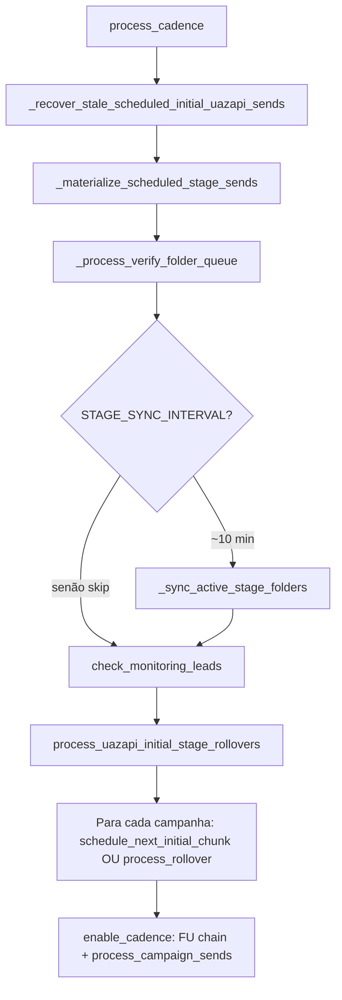

# Uazapi — análise exploratória: schedule, chunks e materialização

Documento de mapeamento do **comportamento atual** do código (sem refatoração), alinhado ao pedido de análise de `campaign_stage_sends`, `worker_cadence`, sync Uazapi e `create_advanced_campaign`.

---

## 1. Mapa do fluxo end-to-end

### 1.1 Visão resumida (ordem de execução no worker)

O loop principal é `process_cadence` em `worker_cadence.py`.

### 1.2 Onde o próximo chunk é agendado (`scheduled_for`, BRT, cota)

| Peça | Arquivo / função | Papel |
| --- | --- | --- |
| Slot “matinal” e mesmo dia (D1) | `utils/initial_chunk_schedule_target.py` — `cadence_next_initial_send_slot`, `resolve_initial_chunk_schedule_target`, `uazapi_same_day_initial_chunk_after_unlock_enabled` | Define o instante alvo (BRT) **antes** do `INSERT` em `campaign_stage_sends`. O env `UAZAPI_SAME_DAY_INITIAL_CHUNK_AFTER_UNLOCK` permite chunk no mesmo dia após o horário de início, se janela BRT + cota permitirem. |
| Normalização para UTC naive + janela válida | `utils/next_valid_uazapi_send.py` — `next_valid_send_utc_naive` (usada em `schedule_next_initial_chunk` e em stale recovery) | Garante que o `scheduled_for` gravado cai numa janela de envio da campanha. |
| Cota diária (TD-12 / G2 default) | `utils/limits.py` — `check_initial_chunk_daily_quota_for_campaign`; `utils/campaign_send_policy.py` — `INITIAL_CHUNK_DAILY_QUOTA_POLICY`, `initial_chunk_daily_quota_allows` | `schedule_next_initial_chunk` e `_recover_stale_scheduled_initial_uazapi_sends` consultam a cota; **inserção automática** do próximo chunk usa a cota no ramo D1. API `continue-initial-chunk` em `app.py` também bloqueia com **429** se a cota não permitir. |
| “Chunk ativo” bloqueia duplicar na mesma instância | `utils/limits.py` — `INITIAL_CHUNK_ACTIVE_SEND_STATUSES` = `scheduled`, `running`, `partial`, `queued` | `schedule_next_initial_chunk` e `_continue_initial_chunk_core` (app) só inserem nova linha se **não** houver send nesse conjunto de status para `(campaign_id, stage, instance_id)`. `failed` / `done` **não** bloqueiam. |
| Janela BRT no momento de materializar (não no INSERT) | `worker_cadence.py` — `_materialize_scheduled_stage_sends` + `is_campaign_send_window` / `next_valid_send_utc_naive` (margem `MATERIALIZE_LOOKAHEAD_MIN`) | Se na hora do materialize estiver fora da janela: **bump** de `scheduled_for` para o próximo `next_valid` **ou** `status = failed` se a janela for inválida. |

**Nota importante:** `can_create_campaign_today` em `utils/limits.py` **sempre retorna `True`**; comentário explícito de que o limite antigo por instância/dia foi removido. O gate de volume “real” é a política TD-12 + `daily_limit` da campanha, não esse helper (ainda referenciado em comentários em `initial_chunk_schedule_target.py`).

### 1.3 Janela de materialize automático (UTC)

Definida em `worker_cadence.py` (cabeçalho e docstring de `_materialize_scheduled_stage_sends`):

- `MATERIALIZE_LOOKBACK_MIN` = 15
- `MATERIALIZE_LOOKAHEAD_MIN` = 5

A query SQL (modo automático) filtra `campaign_stage_sends` com `status = 'scheduled'`, `uazapi_folder_id` NULL, `scheduled_for` entre `now_utc - lookback` e `now_utc + lookahead`. O loop Python aplica o mesmo corte em `remaining` (segundos) para evitar drift entre SQL e processamento.

**Efeito prático:** se um `scheduled_for` cair fora da janela (ex.: atraso > 15 min sem tick), a linha **não** é materializada pelo worker nesse passo; entra o fluxo de **stale recovery** (abaixo).

### 1.4 Onde `create_advanced_campaign` roda, persistência de `uazapi_folder_id`

- **Serviço HTTP:** `services/uazapi.py` — `UazapiService.create_advanced_campaign` → `POST /sender/advanced` (`timeout=30`); em erro HTTP ou exceção de transporte retorna **`None`** (não levanta para o worker).
- **Gravação na linha do chunk:** `worker_cadence.py` — `_materialize_scheduled_stage_sends`, após sucesso: `UPDATE campaign_stage_sends` com `uazapi_folder_id`, `instance_remote_jid`, `lead_ids`, `planned_count`, `status = 'running'`, etc.; e `INSERT INTO uazapi_instance_sends` para estatística por instância/dia.
- **Pós-API “queued/scheduled”:** se `result.status` ∈ `queued`, `scheduled`, chama `edit_campaign(..., "continue")` para despertar o envio.
- **Rolos FU / legacy:** `process_uazapi_initial_stage_rollovers`, `process_rollover`, `process_rollover_fu_next` também chamam `create_advanced_campaign` com contexto FU1/FU2/breakup.

### 1.5 Falha de materialize: estado da linha e `lead_ids`

Cenário `_materialize_scheduled_stage_sends` após chamar a API (resumo):

| Situação | Efeito na linha `campaign_stage_sends` | `lead_ids` |
| --- | --- | --- |
| `create_advanced_campaign` retorna vazio/sem `folder_id` (ex.: 500, timeout, 401 — em todos os casos `UazapiService` devolve `None`) | `status = 'failed'` (UPDATE por `send_id`) | **Não** preenchido neste caminho; permanece o que estava (muitas vezes `[]` do INSERT inicial) |
| 0 leads elegíveis (mesmo `scheduled_for` / etapa) | `UPDATE` em massa: `status = 'failed'` para o grupo `(campaign_id, stage, scheduled_for)` | Inalterado |
| `chunk` vazio para uma instância (índice) | `status = 'done'`, `planned_count = 0` | Inalterado |
| Sem mensagens step | `status = 'failed'` | Inalterado |
| Sem `apikey` | `status = 'failed'` | Inalterado |
| Fora da janela BRT (sem `ValueError` no `next_valid`) | `scheduled_for` = próximo `next_valid` (bump) | Inalterado até o materialize bem-sucedido gravar `lead_ids` |
| Fora da janela BRT e janela de campanha inválida | `status = 'failed'` | Inalterado |
| `can_create_campaign_today` falso | **Código:** `can_create_campaign_today` é sempre `True` — ramo inalcançável no estado atual, salvo mudança futura em `limits.py` | — |

O **break** após falha no primeiro segmento de pacing interrompe o laço de segmentos para aquele `send_id` (comportamento documentado no código: falha cedo).

### 1.6 Pré-sync antes de novo folder (Task 6)

- `utils/sync_uazapi.py` — `sync_campaign_stage_sends_before_new_chunk`  
  Condição: env `UAZAPI_RECONCILE_FIND_BEFORE_CHUNK` default `1`; exige `campaign` com send prévio **com** `uazapi_folder_id` na etapa. Chama `sync_campaign_leads_from_uazapi` com `campaigns.uazapi_folder_id` (primeira instância com apikey) para reconciliar antes de outro `create_advanced_campaign`.

- Chamado de: `_materialize_scheduled_stage_sends` (por grupo de campanha/etapa), `schedule_next_initial_chunk`, e caminhos em `app.py` documentados (ex. FU imediato).

Falha no pré-sync: em `_materialize` faz `rollback` e log `uazapi_materialize_pre_sync_failed` — o fluxo de materialize **continua** (não retorna cedo em todos os trechos; ver logs).

### 1.7 Sync periódico, rollover e contadores de chunk

- **`_sync_active_stage_folders` (`worker_cadence.py`)**  
  A cada `STAGE_SYNC_INTERVAL_MINUTES` (10), para sends com `status IN ('scheduled','running','partial')` e `uazapi_folder_id` não nulo e `last_sync_at` antigo, chama `sync_campaign_leads_from_uazapi` na pasta da **campanha** (`campaigns.uazapi_folder_id`).

- **Fonte de verdade agregada:** comentários em `utils/sync_uazapi.py` e `worker_cadence.py` — `GET /sender/listfolders` (`log_sucess`, `log_failed`, `log_total`, status da pasta). `listmessages` não substitui totais oficiais.

- **`process_uazapi_initial_stage_rollovers`:** considera sends `initial` com `status IN ('done','partial')`, `fu_rollover_done = false`, `enable_cadence` e Uazapi. Rollover quando `success_count + failed_count >= planned_count`. Opcional: `sync_campaign_leads_from_uazapi` antes, se `UAZAPI_RECONCILE_FIND_BEFORE_ROLLOVER`; gate `should_block_initial_rollover_for_pending_find` (message_find / D9).

- **Fila pós-create:** `_process_verify_folder_queue` — ~3 min após create, `list_folders` para verificar se a pasta existe (só log).

---

## 2. Tabela: cenário → comportamento atual → gap

| Cenário | O que o código faz hoje | Gaps / observações |
| --- | --- | --- |
| **A. Instância desconectada / API 500 com `{"error":"No session"}`** | `create_advanced_campaign` recebe status ≠ 200, `raise_for_status` → exceção → retorno **`None`**. Materialize trata como falha: `status = 'failed'`, **sem** pasta. Não diferencia "No session" de outro 500 no retorno. | Operador: chunk `failed` sem `uazapi_folder_id`. Próximo chunk: só quando `schedule_next_initial_chunk` inserir de novo (não re-tenta sozinho no mesmo minuto). |
| **B. Timeout ou 5xx genérico Uazapi** | Idem: `None` → linha `failed`. Logs em stderr da app/worker. | Idem. Sem classificação retryable vs terminal no código do cliente. |
| **C. `scheduled` + `planned_count > 0` com `uazapi_folder_id` NULL após N min** | O INSERT de `schedule_next_initial_chunk` usa `planned_count = 0` e `lead_ids = '[]'`. O `planned_count` preenche **após** create bem-sucedido. Cenário real: linha fica `scheduled` sem pasta **e** 0 planeado — típico de: (1) ainda na janela de espera, (2) fora da janela UTC de materialize, (3) stale > TTL. Recovery: `_recover_stale_scheduled_initial_uazapi_sends` se `scheduled_for < now - 90 min` (env `UAZAPI_STALE_RECOVERY_TTL_MINUTES`): bump `scheduled_for` para `next_valid` **ou** `failed` (sem apikey, janela inválida, modo `mark_failed`). | Se N < TTL, a linha pode **permanecer** `scheduled` sem pasta (até entrar no materialize + lookback/lookahead). Admin: tabela de chunks mostra `scheduled` / pasta vazia. |
| **D. Pasta criada, envio parcial (`success` + `failed` vs `planned`)** | Sync (`sync_campaign_leads_from_uazapi`) atualiza contagens a partir de listfolders (cap em `planned_count`) e `message_find` em estados D4. Rollover inicial: promove FU1 quando `succ + fail >= planned` — **falhas parciais na API não bloqueiam** avanço para quem recebeu envio. Leads que falharam na API podem permanecer em Inicial conforme reconciliação. | Operador pode ver `partial` e contagens; precisa de sync para alinhar leads. Documentado em docstrings do rollover. |
| **E. “Dia seguinte” após falha (produção)** | `schedule_next_initial_chunk` coloca o próximo slot em geral com `cadence_next_initial_send_slot` → **um slot matinal no dia seguinte** (a menos que D1 + env + cota + janela permitam mesmo dia). `failed` **não** bloqueia nova linha. Se o operador **não** tiver cota / slot no mesmo dia, o próximo INSERT será naturalmente D+1. | Comportamento esperado dado o desenho “um insert automático por dia civil” + stale bump para `next_valid` (pode ser amanhã no início da janela). |

**Admin (UI):** `templates/admin/campaigns.html` mostra colunas de stage, `scheduled_for`, `status`, contadores, `uazapi_folder_id`. Rota de flush stale em `app.py` chama `_recover_stale_scheduled_initial_uazapi_sends` com modos `recovery` / `mark_failed` (auditoria `admin_uazapi_stale_flush_audit`).

**API “Continuar chunk”:** `app.py` — `POST /api/campaigns/<id>/continue-initial-chunk` → `_continue_initial_chunk_core` insere `scheduled` e chama `_materialize_scheduled_stage_sends(conn, force_send_ids=...)`. Respostas **200 / 207 / 502** conforme `utils/continue_initial_chunk_report.py` e presença de exceção na materialização imediata.

---

## 3. Débito técnico explícito

| Tema | Onde aparece |
| --- | --- |
| **Regras duplicadas (continuar vs worker)** | `schedule_next_initial_chunk` e `_continue_initial_chunk_core` repetem: instâncias Uazapi, delays, `INITIAL_CHUNK_ACTIVE_SEND_STATUSES`, carga de mensagens step 1, INSERT de `campaign_stage_sends` — o app força janela com `now+30s` ou `next_valid` com margem `MATERIALIZE_LOOKAHEAD_MIN` quando fora da janela BRT. |
| **Janelas materialize (lookahead/lookback)** | Constantes só em `worker_cadence.py`; comentário “SSOT” compartilhada entre SQL e Python. Qualquer `INSERT` de `scheduled_for` em `app.py` deve cair no intervalo de materialize automático ou depender de `force_send_ids` / tick seguinte. |
| **`can_create_campaign_today` obsoleto** | `utils/limits.py` — retorno fixo `True`; materialize ainda contém o ramo condicional (inalcançável). Comentários em `initial_chunk_schedule_target.py` alertam. |
| **Múltiplas camadas de feature flags** | `UAZAPI_SAME_DAY_INITIAL_CHUNK_AFTER_UNLOCK`, `UAZAPI_STALE_RECOVERY_*`, `UAZAPI_RECONCILE_FIND_BEFORE_ROLLOVER`, `UAZAPI_RECONCILE_FIND_BEFORE_CHUNK`, `UAZAPI_LEAD_RECONCILE_V2`, `UAZAPI_MESSAGE_FIND`, etc. — espalhadas com defaults distintos; risco de comportamento “depende do ambiente”. |
| **TODOs / Task labels** | Docstrings em `worker_cadence.py` e `utils/sync_uazapi.py` referem Task 3/5/6/7, D1, D3, D4, D9, D10, F7, F10, T6–T10 — úteis para rastreio, mas misturam spec de produto e código. |
| **Dois caminhos de rollover “Inicial → FU”** | `process_uazapi_initial_stage_rollovers` (cadência + Uazapi) vs `process_rollover` (rollover diário + list_messages Sent) — campanhas/configurações diferentes. |

---

## 4. Jornada ideal (recomendação de comportamento — sem implementar)

**Princípio:** separar **(a) saúde da conexão WhatsApp**, **(b) transiente de API**, e **(c) política de agendamento de negócio** (cota, janela BRT, anti-spam).

### 4.1 P0 (confiança operacional e recuperação)

1. **Classificação de erro em `create_advanced_campaign`:** persistir categoria (`no_session` vs `timeout` vs `5xx` vs `4xx`) para métricas e **retry** distinto. Hoje tudo vira `None` + `failed` genérico.
2. **“No session” / desconectado:** não tratar como falha terminal de negócio da mesma forma que validação: preferir `scheduled` com `scheduled_for` curto (backoff) + mensagem clara no admin, ou flag explícita `last_error_code` na linha do chunk.
3. **Staleness sem surpresa:** alinhar expectativa: ou TTL < janela de materialize com bump agressivo, ou alerta proativo se `scheduled` sem pasta e `now - scheduled_for` > X minutos.
4. **Uma fonte de verdade** para “posso criar outro chunk nesta instância?” (já existe `INITIAL_CHUNK_ACTIVE_SEND_STATUSES`; evitar duplicar condições em outro módulo).

### 4.2 P1 (UX e alinhamento produto)

1. **Rationale no admin** quando `scheduled` sem pasta: exibir *porquê* (fora de janela UTC, aguardando token, cota, stale recovery na próxima iteração).
2. **Continuar chunk** (API) + worker: resposta 207/502 já dão pistas; unificar com mensagens de *instância desconectada* se o backend obtiver `get_status` opcionalmente antes de POST (custo: mais chamada HTTP).
3. **Cota (G2)** e **D1** documentados no painel: operador entende D+1 vs mesmo dia.
4. **Rollover com parcial:** UI já mostra contadores; especificar *copy* de que leads falhos na Uazapi podem ficar na Inicial até nova ação (comportamento atual do rollover).

### 4.3 Ordem de prioridade sugerida

| Prioridade | Item |
| --- | --- |
| **P0** | Observabilidade e taxonomia de erros de materialize; retentativas com backoff para erros conhecidos de sessão/5xx. |
| **P0** | Revisar interação **stale recovery** (90 min) × **janela materialize** (15 min) — hoje gera estados “presos” conhecidos. |
| **P1** | Unificar regra de agendamento entre `app` e `worker` (helper único de “próximo `scheduled_for`”). |
| **P1** | Remover ou reimplementar `can_create_campaign_today` se não tiver efeito. |
| **P2** | Documentar flags em um único `docs/` ou tabela de env (reduzir surpresas entre ambientes). |

---

## 5. Riscos (residuais)

- **Janela UTC de materialize estreita:** chunks que “ficam para trás” > 15 min dependem de stale recovery ou de `force` via continue API; risco de operador ver linhas `scheduled` sem ação.
- **Dupla natureza de `listfolders`:** se a API atrasar ou retornar lista sem a pasta, sync pode atrasar reconciliação (comentários já admitem “próximo listfolders ~10 min”).
- **Pacing (múltiplos segmentos):** primeiro segmento com falha dá `break` — restantes daquele send podem não ser criados naquele passo.
- **Segurança/operacional:** admin stale flush e force de campanha fora de `running|pending|completed` podem marcar `failed` em massa; existe auditoria, mas requer *runbook*.

---

## 6. Sugestão de testes

### 6.1 Já existentes (referência)

- `tests/test_worker_cadence_initial_chunk.py` — `INITIAL_CHUNK_ACTIVE_SEND_STATUSES`
- `tests/test_worker_materialize_outside_brt.py` — materialize fora da janela BRT
- `tests/test_worker_stale_recovery.py` — recovery de scheduled stale
- `tests/test_sync_uazapi.py` — amplo cobertura de sync / message_find / orfãos
- `tests/test_continue_initial_chunk_ac13.py` — outcomes por instância após continuar
- `tests/test_campaign_send_policy.py` — política G1/G2/G3 e `check_initial_chunk_daily_quota_for_campaign`

### 6.2 Manuais sugeridos

1. **Desconectar** instância na Uazapi → deixar worker passar → verificar `campaign_stage_sends` (esperado: `failed` após materialize, sem `uazapi_folder_id`).
2. **Simular** resposta 500 (mock ou proxy) no `/sender/advanced` → mesma verificação.
3. **Chunk `scheduled` com `scheduled_for` no passado** > 90 min → após tick, verificar bump de `scheduled_for` ou `failed` conforme quota/apikey.
4. **Criar pasta com sucesso** e interromper envio parcial → sync manual (rota ou worker) → contadores e `partial` / rollover.

### 6.3 Automatizados (ideias)

- **Unit:** mock de `UazapiService.create_advanced_campaign` retornando `None` e assert de `UPDATE ... status = 'failed'` em harness DB ou mock de cursor (padrão dos testes de `test_worker_*`).
- **Unit:** `classify_initial_chunk_send_row` para combinações `scheduled` com e sem `uazapi_folder_id` (já parcialmente em `test_continue_initial_chunk_ac13`).
- **Integração (se houver):** `process_cadence` com ordem garantida recovery → materialize, verificando que `force_send_ids` ignora janela (como em testes de materialize).

---

## 7. Índice de símbolos (localização rápida)

| Símbolo / conceito | Local principal |
| --- | --- |
| `process_cadence`, `_materialize_scheduled_stage_sends`, `schedule_next_initial_chunk`, `process_uazapi_initial_stage_rollovers` | `worker_cadence.py` |
| `MATERIALIZE_LOOKAHEAD_MIN`, `MATERIALIZE_LOOKBACK_MIN` | `worker_cadence.py` |
| `_recover_stale_scheduled_initial_uazapi_sends` | `worker_cadence.py` |
| `sync_campaign_leads_from_uazapi`, `sync_campaign_stage_sends_before_new_chunk` | `utils/sync_uazapi.py` |
| `create_advanced_campaign`, `list_folders` | `services/uazapi.py` |
| `INITIAL_CHUNK_ACTIVE_SEND_STATUSES`, `check_initial_chunk_daily_quota_for_campaign` | `utils/limits.py` |
| `resolve_initial_chunk_schedule_target`, `cadence_next_initial_send_slot` | `utils/initial_chunk_schedule_target.py` |
| `INITIAL_CHUNK_DAILY_QUOTA_POLICY` | `utils/campaign_send_policy.py` |
| `_continue_initial_chunk_core`, `continue_initial_chunk` | `app.py` |
| `summarize_initial_chunk_materialization_rows` | `utils/continue_initial_chunk_report.py` |
| Rota admin stale recovery | `app.py` (lookup `_recover_stale_scheduled_initial_uazapi_sends`) |

---

*Documento produzido como análise estática do repositório; comportamento de produção pode depender de variáveis de ambiente não inspecionadas em runtime.*
