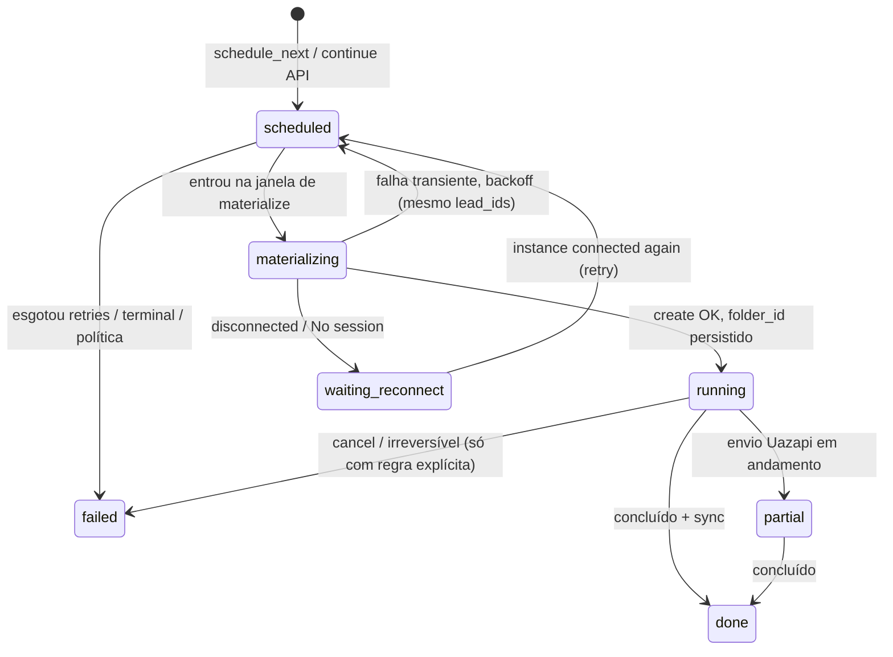
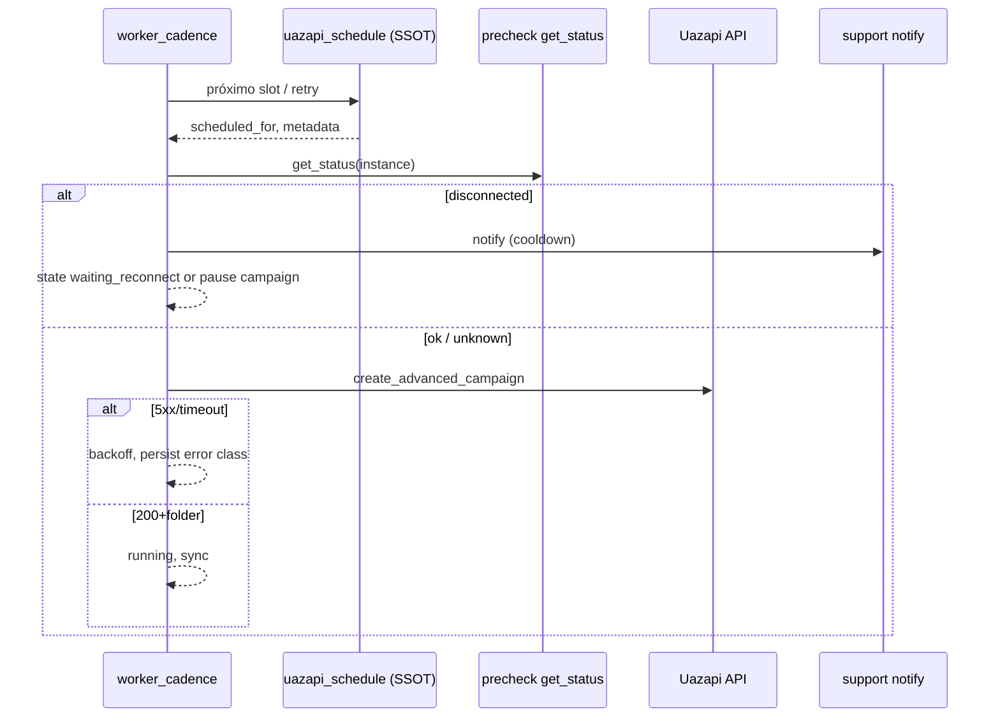

# Especificação — refatoração: schedule, materialize e resiliência Uazapi

**Status:** proposta de produto + engenharia (não implementada).  
**Entrada obrigatória (QA / análise):** `docs/UAZAPI_SCHEDULE_CHUNKS_MATERIALIZE_EXPLORATORY.md` — gap analysis, fluxo atual, janela de materialize, e débito técnico (duplicação `app.py` / `worker_cadence`, ausência de taxonomia de erro no cliente Uazapi, `failed` sem `lead_ids` alocados, “dia seguinte” após slot matinal + `failed` não bloquear).

---

## 0. Problema e objetivos

| Problema observado | O que a análise de QA atribui ao código de hoje |
| --- | --- |
| 500 com `No session` → utilizador sem aviso no produto | `create_advanced_campaign` devolve `None` para qualquer HTTP ≠ 200; materialize grava `failed` sem distinguir desconexão; não há notificação ao dono. |
| Após chunk `failed` (sem folder), o próximo agendamento “parece” D+1 | `schedule_next_initial_chunk` usa slot matinal / `cadence_next_initial_send_slot`; `failed` não entra em `INITIAL_CHUNK_ACTIVE_SEND_STATUSES`, logo pode inserir nova linha no **próximo** slot canónico (sou muitas vezes manhã seguinte). `lead_ids` muitas vezes ainda `[]` no caminho de falha — risco de elegibilidade vs duplicação mal documentada. |

**Objetivo da refatoração:** uma cadeia coerente **schedule → (pré-checagem) → create (API) → materialize → sync**, com:

- estado persistido e inspeccionável;
- retomada após falha **transiente** com backoff na **mesma janela de negócio** quando a política assim o exigir;
- **sem** reenvio duplicado ao mesmo lead (alinhado a `lead_ids` + pastas Uazapi + sync);
- **sem** abandono dos leads do chunk que falhou antes de pasta;
- tratamento explícito de **desconexão** (utilizador avisado + campanha em estado controlado).

**Fora de escopo (confirmado):** alterar o contrato da API Uazapi fora do cliente HTTP existente; redesign completo do admin (apenas estados / mensagens / hooks).

---

## 1. Decisões de produto (travadas nesta spec)

### 1.1 Retentativa automática vs pausa após desconexão

| Decisão | Escolha | Fundamento |
| --- | --- | --- |
| Após detetar instância **desconectada** (pré-checagem ou corpo `No session`) | **Pausa lógica da materialização** para essa instância/campanha: não chamar `create_advanced_campaign` em loop a cada 30s. | Evita carga na Uazapi e no worker; alinha com a realidade (reconexão é ação do utilizador). |
| Retentativas **automáticas** | Aplicar só a erros classificados como **transientes** (rede, 502/503/504, timeout) **enquanto** a instância estiver **connected** (ou status desconhecido após 1 leitura). | Backoff com teto; não substitui reconexão. |
| “Dia seguinte” | **Não** empurrar automaticamente para o próximo dia civil **só** porque houve um 5xx transiente na mesma janela; o **próximo** `scheduled_for` deve ser recalculado por uma **função única** (ver §4) com política: `retry_at` (backoff) vs `next_valid_brt` (janela) vs “slot diário canónico” (anti-flood). | Corrige a percepção de “saltou para amanhã” após falha evitável. |

*Nota:* “Pausa lógica” pode mapear para `campaigns.status` auxiliar, coluna `materialization_block_reason`, ou tabela de fila; ver §3.1.

### 1.2 Notificação (Parte A) — frequência máxima e idempotência

| Regra | Valor sugerido (configurável) |
| --- | --- |
| Máximo de avisos **por (user_id, instance_id)** por incidente de desconexão | 1 notificação / 24h por defeito (env `SUPPORT_NOTIFY_DISCONNECT_COOLDOWN_HOURS` ou tabela `user_notification_cooldown`). |
| Deduplicação | Chave: `hash(user_id, instance_id, 'uazapi_disconnected')` + janela temporal; persistir `last_notified_at` (ex.: em `instances` ou tabela `notification_log`). |
| Opt-out | Env `SUPPORT_UAZAPI_NOTIFY_ENABLED=0` desliga avisos (só log + admin); opt-out por utilizador fica como P2 se necessário. |

**Texto da mensagem (obrigatório, variáveis):**

> `{nome}, sua instância de Whatsapp está desconectada. Acesse o *Leads Infinitos* e reconecte para garantir o funcionamento da sua automação.`

- `{nome}`: display name do utilizador — **gap presente:** a tabela `users` no bootstrap de `app.py` hoje tem `email` + `password_hash` (sem coluna `name`); a implementação deve **adicionar** `display_name` (ou reutilizar email local antes de `@`) e, para WA, **número** de contacto (novo campo em `users` ou tabela de perfil). Até lá, fallback: e-mail transacional + log (ver §8).
- Formatação `*negrito*` — confirmar se a API de envio (Uazapi `send_text`) suporta metadados WhatsApp; se não, enviar texto plano sem `*`.

### 1.3 “Restart/reconnect” (limitação Uazapi)

- **Spec técnica:** a rotina de **reconnect** no produto = **sinalizar ao utilizador** (notificação Parte A) + link para o fluxo já existente de QR/conexão no app (não supor `POST /instance/connect` em loop sem ação do utilizador, salvo alinhamento explícito com a documentação Uazapi e testes de segurança).
- Opcional (flag): **uma** tentativa de `UazapiService.connect(token)` (instância avariada) apenas se o prod quiser “despertar” sessão — default **off**.

---

## 2. Parte A — Notificação e pré-checagem (engenharia)

### 2.1 Granularidade e ordem

| Momento | Ação | Motivo |
| --- | --- | --- |
| **A — Por tentativa** imediatamente **antes** de `create_advanced_campaign` (e opcionalmente antes de `POST` no mesmo tick para FU) | `get_status(token_campanha)` na instância do send | Rejeitar cedo; evita 500 e classifica desconexão. |
| **B — Por tick (opcional / cache)** | Não invocar `get_status` para todas as instâncias a cada 30s sem cache; TTL em memória Redis **ou** “última leitura + 60s” por `instance_id` | NFR: rate limit à API Uazapi. |
| Se `get_status` falhar (None / timeout) | Não notificar desconexão; tratar como “desconhecido” e deixar fluxo de erro transiente (ou 1 retry de status). | Evitar falso “disconnected”. |

**Decisão:** o pré-checque **mínimo** exigido para esta spec é **por tentativa de materialize**; cache por tick é **recomendado** antes do volume subir.

### 2.2 Aviso ao “número do cliente” via instância de suporte

- **Token:** lido de variável de ambiente `SUPPORT_UAZAPI_INSTANCE_TOKEN` (nunca commitar o valor; inject no deploy).
- **Destinatário:** número de WhatsApp do **dono** da campanha — provavelmente **não** existe no schema atual; a spec exige **migração** `users.phone_e164` (ou entidade `user_contact`) **ou** uso de telefone já guardado em outra tabela (a confirmar no desenho). Enquanto inexistente: notificação **não-WA** (e-mail) + banner in-app para cumprir o “utilizador avisado” de forma honesta.
- **Envio:** `UazapiService.send_text(support_token, e164_destino, message)` (ou API equivalente já usada no projeto). Validar tamanho e JID.
- **Segurança:** token de suporte só em segredo/secret manager; logs **sem** token; sem PII além do necessário em logs estruturados.

### 2.3 NFR: logs e métricas

Log estruturado (JSON) sugerido:

- `event`: `uazapi_precheck`, `uazapi_disconnect_notify_skipped_cooldown`, `uazapi_disconnect_notify_sent`, `uazapi_materialize_blocked_disconnected`
- `campaign_id`, `instance_id`, `user_id`, `send_id` (quando existir)
- Nunca logar `apikey` / token.

---

## 3. Parte B — Estados, invariantes e sync de leads

### 3.1 Máquina de estados alvo — `campaign_stage_sends` (etapa Uazapi com pasta)

**Notas:**

- `materializing` pode ser **sub-estado** implementado com coluna `materialize_attempt_at` + `status=scheduled` **ou** valor de enum novo — decisão de schema em §5.
- `waiting_reconnect` pode ser `campaigns.uazapi_materialize_paused` + `reason=disconnected` se preferir **uma** coluna a nível de campanha em vez de por linha.

**Invariantes:**

1. Se `uazapi_folder_id` IS NULL, não pode existir `status IN ('running','partial','done')` (exceto se definirem `running` sem folder legado; migração deve normalizar).
2. Se `lead_ids` preenchido e sem folder, a linha está em **pré-API** (materializing ou scheduled com retry) — o SQL de **exclusão** de leads para novo chunk (ver análise QA) deve considerar **reserva** explícita (ver §3.2).

### 3.2 Leads no chunk: modelo único pós-refatoração (proposta)

| Conceito | Comportamento alvo | Relação com o gap atual |
| --- | --- | --- |
| **Reserva** | Ao alocar leads a um `send_id` **antes** de `create_advanced_campaign`, persistir `lead_ids` (e opcionalmente `reservation_status=pending_create`). | Hoje, em falha cedo, `lead_ids` pode continuar `[]` — a exclusão SQL de outros chunks pode **re-oferecer** o mesmo lead ou gerar condição de corrida. |
| **Elegibilidade** | Leads em `reservation` para um send **falhado** sem folder tornam-se elegíveis **só** após `release` explícita (falha terminal) ou reassign para novo `send_id` na mesma campanha/etapa. | Garante “sem abandono” e “sem duplicar” alinhado a sync. |
| **Já contabilizado na Uazapi** | Continuar a tratar `last_sent_folder_id` + sync (como hoje) como prova de envio; não realocar lead com envio confirmado. | Não regressão. |

**Critério de aceite B3:** se um chunk falha **sem** folder, os leads alocados nesse send devem **aparecer** no próximo `schedule`/`materialize` (novo `send_id` ou retry na mesma linha conforme decisão) **sem** duplicar envio já em pasta anterior.

### 3.3 Falhas transientes: política de `scheduled_for`

- Classificar erros: `transient_network`, `transient_5xx`, `transient_no_session` (a última, na prática, vira **waiting_reconnect** após notificação — não D+1 automático).
- `next_attempt_at_utc` = `now + backoff(attempt)` com teto (ex. máx. 1h para worker 30s → tentativas espalhadas N vezes, não spam).
- **Não** substituir por `cadence_next_initial_send_slot` **apenas** por ter falhado; só usar slot matinal D+1 quando a política de **anti-flood** ou cota exigir (reuso da função única de §4).

### 3.4 Fonte de verdade única (Parte B4)

Extrair módulo compartilhado, por exemplo `utils/uazapi_chunk_schedule.py` (nome final livre), responsável por:

- Dado: `campaign` (janela BRT, `scheduled_start`, cota, flags D1), `context` (retry vs primeiro chunk do dia), `now_utc`  
- Devolver: `ScheduledDecision { scheduled_for_utc_naive, allow_insert, reason, policy_tag }`  
- Consumidores: `worker_cadence.schedule_next_initial_chunk`, `app._continue_initial_chunk_core`, (opcional) `recover_stale` para bump coerente.

**Eliminar divergência:** hoje o app usa `now+30s` ou `next_valid` com `MATERIALIZE_LOOKAHEAD_MIN`; o worker usa `initial_chunk_schedule_target` + `next_valid` com margem 0 — tudo passa a uma **única** política parametrizada.

Janela de **materialize** (`LOOKAHEAD/LOOKBACK`) permanece NFR do worker, mas a **regra de negócio** “quando o próximo chunk pode existir” não depende de constantes espalhadas.

---

## 4. Sequência alvo (visão de runtime)

---

## 5. Plano de migração de dados

1. **Inventário:** linhas `status='scheduled' AND uazapi_folder_id IS NULL` com `scheduled_for` muito no passado — já coberto por `UAZAPI_STALE_RECOVERY_TTL_MINUTES` (rever para alinhar com nova coluna de retry).
2. **Normalização:** backfill de `last_materialize_error_code` nulo; mapear `failed` recents → `failed|retryable` só se houver log (opcional, pode ser forward-only).
3. **Reserva de `lead_ids`:** migração pode **não** forçar backfill; a partir de versão N, **todo** materialize que escolhe leads grava `lead_ids` **antes** do `POST` (transação: lock de leads vs duplicata).
4. **Compatibilidade:** manter `INITIAL_CHUNK_ACTIVE_SEND_STATUSES` sincronizado com o novo enum (ex.: adicionar `materializing` e `waiting_reconnect` se bloquearem o mesmo que `scheduled`).

---

## 6. Critérios de aceite mensuráveis (MVP desta spec)

1. **Desconexão durante campanha:** utilizador recebe **no máximo 1** WhatsApp de suporte / 24h / instância (com cooldown) quando a desconexão for detetada no fluxo; log `uazapi_disconnect_notify_sent` ou `skipped` com motivo.
2. **Pausa vs retry:** campanha/instância com desconexão **não** gera N chamadas a `create_advanced_campaign` com o mesmo padrão de failure; após reconexão (status connected), o worker retoma (transição `waiting_reconnect` → `scheduled`/`materializing`).
3. **Chunk sem folder após alocação:** leads do chunk **não** saem do conjunto de pendentes sem decisão; próximo sucesso **não** reenvia para o mesmo lead que já consta como enviado noutra pasta (invariantes de sync atuais preservados).
4. **Não regressão:** `sync_campaign_leads_from_uazapi`, listfolders, contadores e admin (visão mínima de estado/reason) permanecem coerentes; testes existentes de `test_sync_uazapi.py` / `test_worker_*` ajustados.

---

## 7. Testes (além do documento de QA)

- **Unit:** classificador de erros a partir de `response` JSON (`No session`) e status HTTP, sem chamar rede.
- **Unit:** `ScheduledDecision` — mesmo input → mesmo output para worker e app.
- **Integração (opcional):** mock Uazapi: sequência get_status → disconnected → notify 1x → get_status → connected → create success.
- **Carga:** com cooldown, garantir N ticks não geram N `send_text` de suporte.

---

## 8. Dependências e riscos

- **Dependência directa do QA:** análise em `docs/UAZAPI_SCHEDULE_CHUNKS_MATERIALIZE_EXPLORATORY.md` (gaps C, E, débito duplicação, janela UTC 15+5 min).
- **Número do utilizador:** se o produto ainda não tiver telemóvel obrigatório, a Parte A precisa de **fallback** (e-mail + banner in-app) para cumprir o “utilizador avisado” na aceite 1.
- **Token de suporte:** operação (deploy) deve fornecer `SUPPORT_UAZAPI_INSTANCE_TOKEN`; risco de ambiente de staging sem token — deflag `SUPPORT_UAZAPI_NOTIFY_ENABLED`.

---

## 9. Changelog

| Data | Nota |
| --- | --- |
| 2026-04-29 | Versão inicial da spec, alinhada à análise de QA e requisitos de negócio. |

---

*Texto aprovado para início de desenho técnico (tasks) e estimativa; ajustar decisões 1.1/1.2 com PM se “pausa lógica” tiver de refletir-se no Kanban (UI mínima).*
